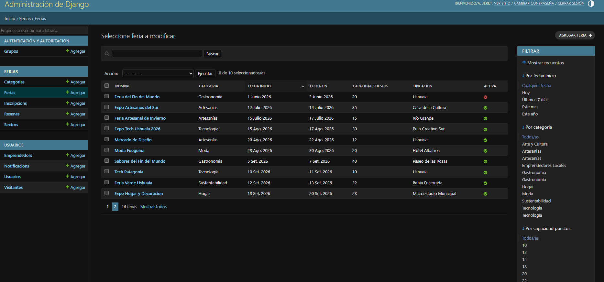
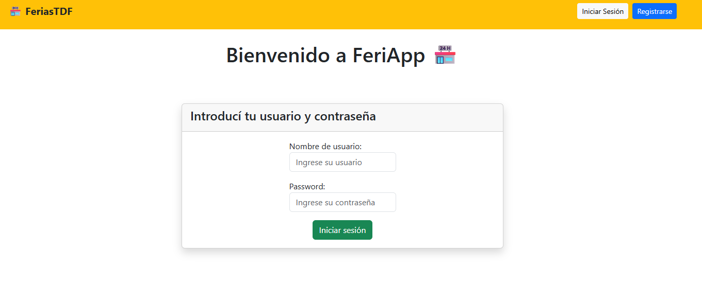

# FeriApp 🏪

Sistema web de gestión de ferias y emprendedores desarrollado con Django 5.2+.  
Permite administrar ferias temáticas, gestionar inscripciones de emprendedores y controlar la disponibilidad de puestos, con autenticación de usuarios y panel de administración.

---

### Rama de desarrollo -> dev

## 🛠️ Stack

| Tecnología           | Versión                |
| -------------------- | ---------------------- |
| Python               | 3.13+                  |
| Django               | 5.2+                   |
| Base de datos        | SQLite (desarrollo)    |
| Frontend             | Bootstrap 5            |
| Tests                | `django.test.TestCase` |
| Control de versiones | Git + GitHub           |

---

## ✨ Funcionalidades

- 🔐 Registro, login y logout de usuarios
- 🗂️ Gestión de categorías y ferias
- 🧑‍💼 Gestión de emprendedores
- 📋 Inscripción a ferias con control de disponibilidad de puestos
- 📊 Panel de inicio con estadísticas generales
- 📈 Barra de ocupación por feria (Bootstrap progress bar)
- 🛠️ Panel de administración Django configurado
- 📱 Interfaz responsiva con Bootstrap 5

---

## 👥 Integrantes

| Nombre             | Usuario GitHub                                 |
| ------------------ | ---------------------------------------------- |
| Jeremias Tamargo   | [@jeretamargo](https://github.com/jeretamargo) |
| Marcos Cerezo      | [@Marcos45C](https://github.com/Marcos45C)     |
| Sebastian Martinez | [@SebaaM](https://github.com/SebaaM)           |

---

## 🚀 Instalación y uso

### 1. Clonar el repositorio

```bash
git clone https://github.com/usuario/feriapp.git
cd feriapp
```

### 2. Crear y activar el entorno virtual

```bash
# Windows
python -m venv .venv
.\.venv\Scripts\Activate.ps1

# macOS / Linux
python3 -m venv .venv
source .venv/bin/activate
```

### 3. Instalar dependencias

```bash
pip install -r requirements.txt
```

### 4. Aplicar migraciones

```bash
python manage.py migrate
```

### 5. Crear superusuario (para el panel admin)

```bash
python manage.py createsuperuser
```

### 6. Carga de datos

```bash

python manage.py loaddata usuarios usuarios_emprendedor usuarios_visitante categorias ferias sectores inscripciones resenas
```

### 7. Correr el servidor de desarrollo

```bash

python manage.py runserver
```

Accedé a [http://localhost:8000](http://localhost:8000)  
Panel admin: [http://localhost:8000/admin](http://localhost:8000/admin)

---

## 🧪 Correr los tests

```bash
# Todos los tests con detalle
python manage.py test -v 2

# Solo tests de modelos
python manage.py test ferias.tests.test_models -v 2

# Solo tests de vistas
python manage.py test ferias.tests.test_views -v 2
```

---

## 🔑 Credenciales de prueba

> ⚠️ Solo para uso del corrector en entorno de desarrollo local.

| Rol                  | Usuario          | Contraseña   |
| -------------------- | ---------------- | ------------ |
| Usuario de prueba (Emprendedor)    | `lucasf` | `123456` |
| Usuario de prueba (Visitante)    | `juanp` | `123456` |
---

## 📁 Estructura del proyecto

```text
feriapp/
├── feriapp/                  # Configuración principal del proyecto Django
│   ├── settings.py
│   ├── urls.py
│   ├── asgi.py
│   └── wsgi.py
│
├── app/                      # Gestión de ferias
│   ├── contexts/             # Context processors
│   ├── fixtures/             # Datos iniciales
│   ├── forms/                # Formularios
│   ├── mixins/               # Control de permisos por rol
│   ├── models/               # Modelos de negocio
│   │   ├── categoria_models.py
│   │   ├── feria_models.py
│   │   ├── inscripcion_models.py
│   │   ├── resena_models.py
│   │   └── sector_models.py
│   ├── templates/            # Plantillas HTML
│   │   ├── categorias/
│   │   ├── ferias/
│   │   ├── inscripciones/
│   │   ├── resenas/
│   │   └── sectores/
│   ├── tests/                # Pruebas unitarias
│   ├── views/                # Vistas de la aplicación
│   └── urls.py
│
├── usuarios/                 # Gestión de usuarios y autenticación
│   ├── fixtures/
│   ├── forms/
│   ├── models/
│   │   ├── user_models.py
│   │   ├── visitante_models.py
│   │   ├── emprendedor_models.py
│   │   └── notificacion_models.py
│   ├── templates/
│   ├── tests/
│   ├── views/
│   └── urls.py
│
├── static/                   # Archivos estáticos (CSS, JS e imágenes)
│
├── manage.py
├── requirements.txt
└── README.md
```

### Organización

- **feriapp/**: configuración principal del proyecto Django.
- **app/**: contiene toda la lógica relacionada con las ferias, categorías, sectores, inscripciones y reseñas.
- **usuarios/**: administra el registro, autenticación, perfiles de usuarios, emprendedores, visitantes y notificaciones.
- **static/**: recursos estáticos como hojas de estilo, scripts e imágenes.
- **fixtures/**: datos de ejemplo para poblar la base de datos durante el desarrollo.
- **tests/**: pruebas unitarias de modelos y vistas.

---

## 🖼️ Capturas

### Inicio


### Detalle de feria


### Panel de administración



### Login



---

## 🧩 Decisiones de diseño


Describir aquí:

- Por qué eligieron este dominio
- Cómo modelaron la disponibilidad de puestos (método vs. anotación ORM)
- Qué validaciones pusieron en el modelo vs. en el formulario
- Cómo dividieron el trabajo entre los integrantes
- Cualquier decisión no obvia (ej: por qué el constraint de puesto único, cómo manejaron lista de espera, etc.)


---

## ⭐ Funcionalidades opcionales implementadas

- [ ] Vista "Mis inscripciones" para el emprendedor autenticado
- [ ] Mensajes flash con `django.contrib.messages`
- [ ] Paginación en lista de ferias
- [ ] Barra de búsqueda por nombre o ubicación
- [ ] Permisos diferenciados (Organizador vs. Emprendedor)
- [ ] Tests de integración (flujo completo)

---

## 🐛 Problemas comunes

| Problema                          | Solución                                                                  |
| --------------------------------- | ------------------------------------------------------------------------- |
| `OperationalError: no such table` | Corré `python manage.py migrate`                                          |
| `No module named django`          | Activá el entorno virtual                                                 |
| Barra de progreso muestra 0%      | Verificá que `puestos_ocupados()` cuenta solo inscripciones `confirmadas` |
| Login no redirige bien            | Verificá `LOGIN_REDIRECT_URL` en `settings.py`                            |
