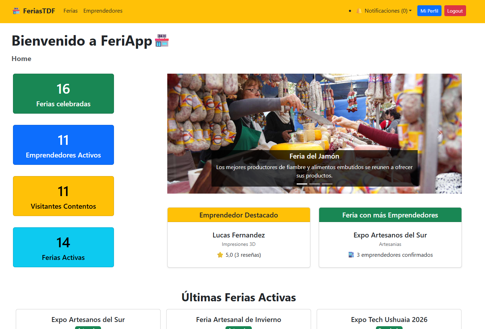
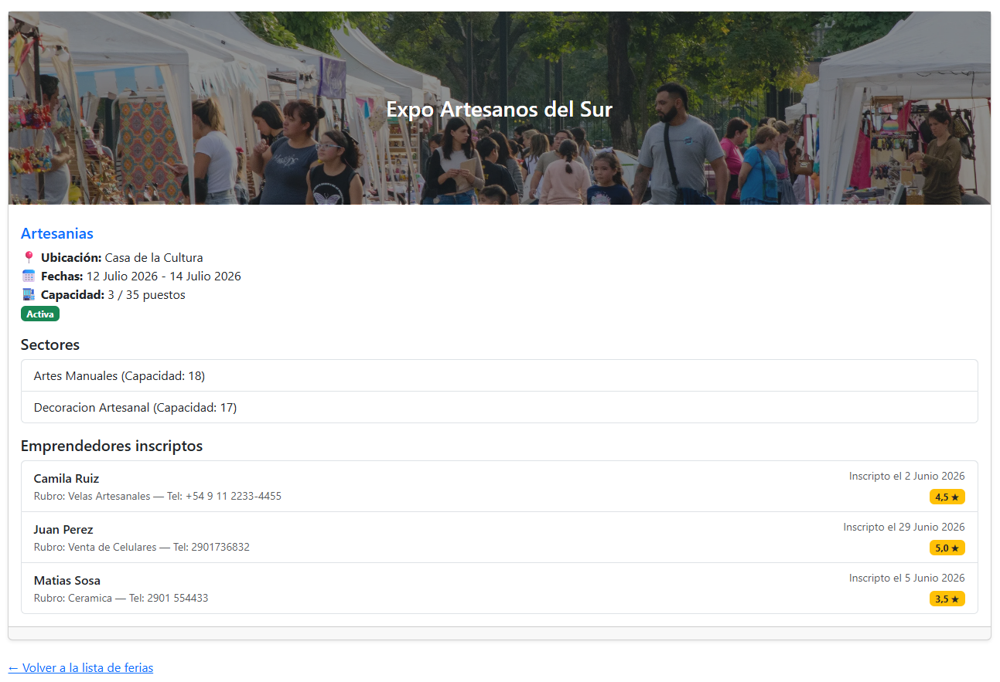

# FeriApp 🏪

Sistema web de gestión de ferias y emprendedores desarrollado con Django 5.2+.  
Permite administrar ferias temáticas, gestionar inscripciones de emprendedores y controlar la disponibilidad de puestos, con autenticación de usuarios y panel de administración.

---

### Rama de desarrollo -> dev

## 🛠️ Stack

| Tecnología           | Versión                |
| -------------------- | ---------------------- |
| Python               | 3.13+                  |
| Django               | 5.2+                   |
| Base de datos        | SQLite (desarrollo)    |
| Frontend             | Bootstrap 5            |
| Tests                | `django.test.TestCase` |
| Control de versiones | Git + GitHub           |

---

## ✨ Funcionalidades

- 🔐 Registro, login y logout de usuarios
- 🗂️ Gestión de categorías y ferias
- 🧑‍💼 Gestión de emprendedores
- 📋 Inscripción a ferias con control de disponibilidad de puestos
- 📊 Panel de inicio con estadísticas generales
- 📈 Barra de ocupación por feria (Bootstrap progress bar)
- 🛠️ Panel de administración Django configurado
- 📱 Interfaz responsiva con Bootstrap 5

---

## 👥 Integrantes

| Nombre             | Usuario GitHub                                 |
| ------------------ | ---------------------------------------------- |
| Jeremias Tamargo   | [@jeretamargo](https://github.com/jeretamargo) |
| Marcos Cerezo      | [@Marcos45C](https://github.com/Marcos45C)     |
| Sebastian Martinez | [@SebaaM](https://github.com/SebaaM)           |

---

## 🚀 Instalación y uso

### 1. Clonar el repositorio

```bash
git clone https://github.com/usuario/feriapp.git
cd feriapp
```

### 2. Crear y activar el entorno virtual

```bash
# Windows
python -m venv .venv
.\.venv\Scripts\Activate.ps1

# macOS / Linux
python3 -m venv .venv
source .venv/bin/activate
```

### 3. Instalar dependencias

```bash
pip install -r requirements.txt
```

### 4. Aplicar migraciones

```bash
python manage.py migrate
```

### 5. Crear superusuario (para el panel admin)

```bash
python manage.py createsuperuser
```

### 6. Carga de datos

```bash

python manage.py loaddata usuarios usuarios_emprendedor usuarios_visitante categorias ferias sectores inscripciones resenas
```

### 7. Correr el servidor de desarrollo

```bash

python manage.py runserver
```

Accedé a [http://localhost:8000](http://localhost:8000)  
Panel admin: [http://localhost:8000/admin](http://localhost:8000/admin)

---

## 🧪 Correr los tests

```bash
# Todos los tests con detalle
python manage.py test -v 2

# Solo tests de modelos
python manage.py test ferias.tests.test_models -v 2

# Solo tests de vistas
python manage.py test ferias.tests.test_views -v 2
```

---

## 🔑 Credenciales de prueba

> ⚠️ Solo para uso del corrector en entorno de desarrollo local.

| Rol                             | Usuario  | Contraseña |
| ------------------------------- | -------- | ---------- |
| Usuario de prueba (Emprendedor) | `lucasf` | `123456`   |
| Usuario de prueba (Visitante)   | `juanp`  | `123456`   |

Para utilizar la app con el rol de Administrador, basta con loguearse con el superuser que hayas creado durante el paso 5 de la seccion "🚀 Instalación y uso"

Tambien pueden loguearse con cualquier usuario, sea emprendedor o visitante que se encuentra en el fixture de datos de usuarios, basta con colocar el nombre de usuario y la contraseña 123456

---

## 📁 Estructura del proyecto

```text
feriapp/
├── feriapp/                  # Configuración principal del proyecto Django
│   ├── settings.py
│   ├── urls.py
│   ├── asgi.py
│   └── wsgi.py
│
├── app/                      # Gestión de ferias
│   ├── contexts/             # Context processors
│   ├── fixtures/             # Datos iniciales
│   ├── forms/                # Formularios
│   ├── mixins/               # Control de permisos por rol
│   ├── models/               # Modelos de negocio
│   │   ├── categoria_models.py
│   │   ├── feria_models.py
│   │   ├── inscripcion_models.py
│   │   ├── resena_models.py
│   │   └── sector_models.py
│   ├── templates/            # Plantillas HTML
│   │   ├── categorias/
│   │   ├── ferias/
│   │   ├── inscripciones/
│   │   ├── resenas/
│   │   └── sectores/
│   ├── tests/                # Pruebas unitarias
│   ├── views/                # Vistas de la aplicación
│   └── urls.py
│
├── usuarios/                 # Gestión de usuarios y autenticación
│   ├── fixtures/
│   ├── forms/
│   ├── models/
│   │   ├── user_models.py
│   │   ├── visitante_models.py
│   │   ├── emprendedor_models.py
│   │   └── notificacion_models.py
│   ├── templates/
│   ├── tests/
│   ├── views/
│   └── urls.py
│
├── static/                   # Archivos estáticos (CSS, JS e imágenes)
│
├── manage.py
├── requirements.txt
└── README.md
```

### Organización

- **feriapp/**: configuración principal del proyecto Django.
- **app/**: contiene toda la lógica relacionada con las ferias, categorías, sectores, inscripciones y reseñas.
- **usuarios/**: administra el registro, autenticación, perfiles de usuarios, emprendedores, visitantes y notificaciones.
- **static/**: recursos estáticos como hojas de estilo, scripts e imágenes.
- **fixtures/**: datos de ejemplo para poblar la base de datos durante el desarrollo.
- **tests/**: pruebas unitarias de modelos y vistas.

---

## 🖼️ Capturas

### Inicio



### Detalle de feria



### Panel de administración


### Login


---

## 🧩 Decisiones de diseño

En este Trabajo Práctico Integrador de la materia Laboratorio de Programación y Lenguajes, el dominio que nos tocó por sorteo fue el de una app que administra Ferias y conecta emprendedores y visitantes.

### Division de Tareas

El trabajo lo dividimos entre los 3 integrantes de la siguiente manera, cada uno se dedico a trabajar en dominios especificos y trabajo en conjunto con otros integrantes en tareas contiguas:

- Sebastián Martínez: Dominios de Feria, Categoría y Sector
- Marcos Cerezo: Dominios de Inscripción y Reseña
- Jeremías Tamargo: Dominios de Usuario, Visitante, Emprendedor y Notificación

Cada integrante realizo los modelos, vistas, templates y formularios correspondientes al dominio que abarcó

### Validaciones implementadas

Se separó la lógica de validación entre modelos y formularios, siguiendo el patrón propuesto por la cátedra (validate(), new() y update()).

#### Validaciones en los modelos

Los modelos contienen las reglas de negocio, garantizando la integridad de los datos independientemente del origen de la información (formularios, panel de administración, shell o futuras APIs).

Entre las principales validaciones implementadas se encuentran:

-Verificación de campos obligatorios.
-Validación de longitudes mínimas para nombres.
-Control de capacidades y valores numéricos positivos.
-Consistencia entre fechas (por ejemplo, que la fecha de fin no sea anterior a la de inicio).
-Restricciones propias del dominio, como: - no permitir inscripciones en puestos ya ocupados; - impedir confirmar una inscripción cuando la feria no posee lugares disponibles; - evitar que la capacidad de un sector supere la capacidad libre de la feria; - impedir reducir la capacidad de una feria por debajo de la suma de sus sectores; - validar rangos de puntuación en las reseñas.

#### Validaciones en los formularios

Los formularios incorporan validaciones orientadas a la experiencia del usuario, detectando errores antes de intentar persistir los datos.

Se implementaron, entre otras:

- Eliminación de espacios en blanco al inicio y final de los textos.
- Longitud mínima de nombres y apellidos.
- Validación de formato de correo electrónico.
- Reglas de seguridad para contraseñas durante el registro (mínimo 8 caracteres, al menos una letra y un número, y que no contenga el nombre de usuario ni el correo electrónico).
- Restricción de fechas para impedir crear ferias o sectores con fechas pasadas.
- Filtrado dinámico de opciones, mostrando únicamente ferias activas para inscripciones y únicamente usuarios administradores en el campo Registrado por del panel de administración.
- Configuración de widgets y atributos HTML (required, min, type="date", etc.) para mejorar la usabilidad de la interfaz.

### Calculo de puestos de ferias

Para modelar la cantidad de puestos disponibles, utilizamos métdos de clase dentro del modelo Feria donde calculamos la cantidad de puestos disponibles de la siguiente manera:

```python
def puestos_ocupados(self):
        """Retorna la cantidad de inscripciones confirmadas."""
        # Mientras Inscripcion no exista, no hay relaciones para contar.
        if not hasattr(self, "inscripcion_set"):
            return 0
        return self.inscripcion_set.filter(estado="confirmada").count()

    def puestos_disponibles(self):
        """Retorna los puestos libres."""
        return self.capacidad_puestos - self.puestos_ocupados()
```

---

## ⭐ Funcionalidades opcionales implementadas

- [x] Vista "Mis inscripciones" para el emprendedor autenticado
- [x] Mensajes flash con `django.contrib.messages`
- [x] Paginación en lista de ferias
- [x] Barra de búsqueda por nombre o ubicación en Admin
- [x] Permisos diferenciados (Organizador vs. Emprendedor)
- [x] Tests completos de todos los modelos
- [x] Notificaciones
- [x] Emprendedor destacado

---

## 🐛 Problemas comunes

| Problema                          | Solución                                                                  |
| --------------------------------- | ------------------------------------------------------------------------- |
| `OperationalError: no such table` | Corré `python manage.py migrate`                                          |
| `No module named django`          | Activá el entorno virtual                                                 |
| Barra de progreso muestra 0%      | Verificá que `puestos_ocupados()` cuenta solo inscripciones `confirmadas` |
| Login no redirige bien            | Verificá `LOGIN_REDIRECT_URL` en `settings.py`                            |
